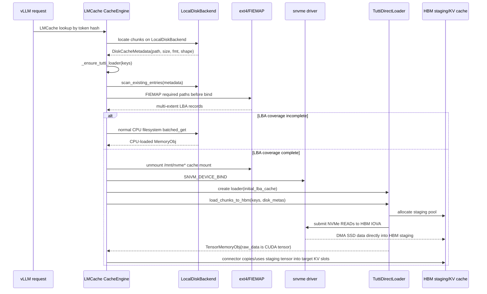

# Tutti 代码库全文件解析

Tutti 是一个 GPU 中心化 KV Cache 存储系统，让 NVMe SSD 在访问延迟上接近 DRAM，核心思路是 GPU 直接发 NVMe 命令（绕过 CPU 和内核的 IO 栈），DMA 直接读写 HBM。本文档逐文件解释其代码库。

---

## 目录结构总览

```
Tutti/
├── LICENSE / README.md
├── backends/local/
│   ├── kernel_modules/
│   │   ├── snvme-5.15.0-public/    ← 核心：自定义 Linux NVMe 驱动
│   │   └── test/                   ← L0 smoke tests（直接 ioctl）
│   └── nvme/
│       ├── libnvm/                 ← 用户空间 NVMe C/CUDA 库
│       └── test/                   ← L1 smoke tests（libnvm API 层）
└── scripts/                        ← 环境准备和驱动管理脚本
```

---

## 一、根目录

### `README.md`
项目简介，说明 Tutti 是 GPU-centric KV Cache Store，目标是让 SSD 表现得像 DRAM。

### `LICENSE`
Apache License 2.0。

---

## 二、`backends/local/kernel_modules/snvme-5.15.0-public/` — snvme 内核驱动（核心）

这是整个 Tutti 系统的核心：一个从 Linux 5.15 NVMe 驱动 fork 并扩展的自定义内核模块，新增了：
1. **GPU 内存映射**：通过 NVIDIA P2P API 把 GPU HBM 页映射成 NVMe 可访问的 IOVA
2. **用户态 IO 队列**：允许用户进程（或 GPU kernel）直接操控 SQ/CQ，不经过内核 IO 栈

整套思路：GPU 写 SQE + 敲 doorbell → snvme 提供的 IOVA 映射让 NVMe 控制器 DMA 直接读写 HBM。

---

### `nvme.h` ★ 最核心的头文件
定义了整个驱动的主要数据结构：

- `struct nvme_gpu_map`：GPU 内存映射描述符，包含 NVIDIA P2P 得到的 DMA 地址
- `GPU_io_queue_info`：GPU 侧 IO 队列信息（SQ/CQ 的 GPU 虚拟地址、物理地址、门铃地址）
- `struct nvme_ctrl`（扩展）：标准 NVMe 控制器结构体，加入了 GPU map list、用户队列池等字段
- `struct nvme_ns`：NVMe namespace 描述符
- 以及所有跨文件共享的函数声明

### `pci.c` ★ 驱动入口
主 PCI 驱动文件，是系统的"门面"：

- 注册 `struct pci_driver snvme_driver`，处理 probe/remove
- 管理 `/dev/snvm_control` 字符设备
- 实现所有 ioctl 分发（`NVM_MAP_DEVICE_MEMORY`、`SNVM_DEVICE_BIND`、`NVM_ADD_USER_QUEUE`、`NVM_CREATE_QUEUE_GROUP` 等）
- **关键 ioctl `NVM_MAP_DEVICE_MEMORY`**：接收 GPU 虚拟地址，调用 nvfs 层把该地址的 HBM 页固定，返回 NVMe 可见的 IOVA——这是 GPU direct IO 的基础

### `map.c` / `map.h`
实现 GPU 内存映射描述符的生命周期：

- `struct map`：每次 `NVM_MAP_DEVICE_MEMORY` 调用创建一个，记录 IOVA 列表、引用计数、所属 fd
- 调用 `nvfs_get_pages()` 固定 NVIDIA P2P 页，获取 DMA 地址
- 支持 B2/B6 扩展字段（`group_id`、`kind`），区分 SQ/CQ ring map 和 DATA buffer map

### `nvfs-p2p.c` / `nvfs-p2p.h`
NVIDIA P2P GPU 内存操作的封装层，**动态解析 NVIDIA 私有驱动符号**：

- 在模块加载时通过 `symbol_get()` 拿到 `nvidia_p2p_get_pages_persistent`、`nvidia_p2p_put_pages`、`nvidia_p2p_dma_map_pages`、`nvidia_p2p_dma_unmap_pages` 等函数指针
- 对上层（`map.c`）提供稳定的 `nvfs_get_pages()` / `nvfs_put_pages()` 接口
- 不写死 NVIDIA 驱动版本，运行时绑定

### `nvfs-pci.c` / `nvfs-pci.h`
PCIe 拓扑分析，用于 GPU-NVMe 最优配对：

- 遍历系统 PCIe 树，构建 GPU 和 NVMe 设备之间的距离矩阵（同 bus < 同 NUMA < 跨 socket）
- 为上层提供 "哪个 GPU 应该 DMA 到哪块 NVMe" 的建议
- 输出格式通过 `PCI_INFO_FMT` 暴露给用户空间

### `ctrl.c` / `ctrl.h`
每个 NVMe 控制器实例的生命周期管理：

- 分配/初始化/销毁 `struct ctrl`（控制器对象）
- 管理 B3 用户队列 ID 池（`b3_uqid_pool`）：决定哪些 QID 可分配给用户态
- 管理 queue group 状态（`snvm_queue_group`）：一组 SQ+CQ 的容器，绑定到特定 fd

### `core.c`
标准 NVMe 驱动 core，从 upstream Linux 5.15 nvme 驱动 fork 并修改：

- 管理 block device 注册、IO 超时、电源管理
- 模块参数（队列深度、超时值等）
- 内核 IO 路径（用于非 GPU 访问）

### `ioctl.c`
NVMe ioctl passthrough 实现：

- 把用户空间的 `NVME_IOCTL_IO_CMD` / `NVME_IOCTL_ADMIN_CMD` 请求转发给控制器
- 处理 metadata、data offset 等细节
- 与 `pci.c` 的 snvme 扩展 ioctl 分工：`ioctl.c` 处理标准 NVMe ioctl，`pci.c` 处理 snvme 专有 ioctl

### `list.c` / `list.h`
自旋锁保护的双向链表，供驱动内部使用（map list、ctrl list 等）。

### `fabrics.c` / `fabrics.h`
NVMe-over-Fabrics (NVMe-oF) 公共主机代码，直接来自 upstream：

- 传输注册（`nvmf_register_transport`）
- Host NQN/UUID 管理
- sysfs connect 接口（`/sys/class/nvme-fabrics/ctl/connect`）

### `rdma.c`
NVMe-oF RDMA 传输驱动（InfiniBand/RoCE/iWarp），upstream 代码：

- 管理 RDMA 队列对、内存注册
- NVMe-RDMA 连接生命周期

### `tcp.c`
NVMe-oF TCP 传输驱动，upstream 代码：

- NVMe/TCP PDU 帧格式
- socket 管理、队列生命周期

> **注意**：`rdma.c` 和 `tcp.c` 是为 NVMe-oF（网络 NVMe）保留的，本地 PCIe NVMe 不走这两个路径。

### `hwmon.c`
NVMe 硬件监控：读取 SMART 温度日志，通过 Linux hwmon 子系统暴露传感器。

### `zns.c`
NVMe Zoned Namespace (ZNS) 支持：查询 zone 容量、配置 max zone-append 大小。

### `Kconfig`
Linux Kconfig 片段，声明 snvme 驱动的各子系统编译选项。

### `Makefile.in`
构建模板：列出 `snvme-core` 和 `snvme` 两个 ko 的源文件组成。

---

## 三、`backends/local/kernel_modules/test/` — L0 smoke tests

这组测试**直接使用 ioctl** 验证 snvme 内核模块的各个 ioctl 接口，不依赖 libnvm。

### `snvme_smoke_gpu.cu` ★ GPU IO 端到端测试（也是我们的参考实现）
完整的 GPU direct IO smoke test：

1. 通过 `NVM_MAP_DEVICE_MEMORY` 把 GPU 内存（SQ ring、CQ ring、data buffer）映射给 NVMe
2. 在 GPU 内存里手建 NVMe Read/Write SQE
3. 用 CUDA kernel 敲 doorbell 提交 SQE，再用另一个 CUDA kernel 轮询 CQE
4. 验证数据完整性，多轮 alloc/free 循环

**包含 4 个 CUDA kernels（均为测试代码，非生产代码）**：
- `k_submit_rw`：单条 SQE 提交（单线程）
- `k_poll_one`：单条 CQE 轮询（单线程）
- `k_fill_pattern`：并行测试数据填充（网格并行）
- `k_verify_pattern`：并行数据校验（用 `atomicCAS` 检测不一致）

> 我们的生产代码 `csrc/tutti_kv_ops.cu` 中的 `k_submit_batch_sgl_read` 和 `k_poll_batch` 正是从 `k_submit_rw`/`k_poll_one` 升级而来，改为批量 N 个 IO。

### `snvme_smoke.c`
L0 UAPI 全接口 smoke：不发真实 IO，只测试 chrdev create/remove、BAR0 mmap、host memory map、set-IOQ、bind/unbind 等 ioctl 是否正常。

### `snvme_smoke_addq.c`
`NVM_ADD_USER_QUEUE`（B3）路径 smoke：测试用户态 SQ+CQ 创建和级联销毁。

### `snvme_smoke_qgroup.c`
`NVM_CREATE_QUEUE_GROUP`/`NVM_DESTROY_QUEUE_GROUP` smoke：测试 queue group 容器生命周期（创建、显式销毁、关闭 fd 时级联销毁、容量限制、跨 fd 隔离）。

### `snvme_smoke_io.c`
CPU 侧 IO smoke：mmap BAR0，手建 NVMe SQE 在 host-mapped ring 里，敲门铃，验证多 LBA 多队列对的数据完整性。

### `snvme_smoke_recycle.c`
`NVM_RAW_ADMIN_CMD` passthrough smoke：bind 控制器后发 Identify Controller admin 命令，验证 CQE status 是否正确回传。

### `Makefile`
构建所有 6 个 smoke test 二进制（CUDA 测试自动检测 compute capability）。

### `run_snvme_smoke.sh`
一键运行 smoke test 的包装脚本：构建、验证 ko 已加载、选 PCI BDF、跑测试、失败时打印 CUDA/fabric 诊断信息。

---

## 四、`backends/local/nvme/libnvm/` — libnvm 用户空间库

libnvm 是对 snvme ioctl 的高级封装，提供 C/C++/CUDA API，让上层代码不必手写 ioctl。

### 公共头文件（`include/`）

| 文件 | 作用 |
|------|------|
| `nvm_types.h` ★ | 核心类型定义：`nvm_ctrl_t`、`nvm_queue_t`、`nvm_cmd_t`、`nvm_cpl_t`、`nvm_dma_t`，以及 CUDA `cuda::atomic` / C fallback 的编译门控 |
| `nvm_ctrl.h` | 控制器句柄 API：`nvm_ctrl_init`（从 snvme fd 初始化）、`nvm_ctrl_free`、`ioctl_get_dev_info` |
| `nvm_queue.h` | 队列描述符管理：`nvm_queue_clear`（初始化 SQ/CQ）、`nvm_queue_reset`、SQE 入队/CQE 出队 inline helpers |
| `nvm_cmd.h` | NVMe IO/admin 命令 opcode 枚举 + `__device__`/`__host__` inline helpers，用于构建 NVMe SQE DWORDs（header、PRP list、cdw10-12 等） |
| `nvm_dma.h` | DMA 映射 API：`nvm_dma_map`（从物理地址）、`nvm_dma_remap`、`nvm_dma_unmap` |
| `nvm_admin.h` | Admin 命令 API：`nvm_admin_ctrl_info`、`nvm_admin_ns_info`、`nvm_admin_set_num_queues`，以及创建/删除 IO SQ/CQ |
| `nvm_aq.h` | `nvm_aq_destroy`：销毁 admin queue-pair 引用 |
| `nvm_rpc.h` | `nvm_raw_rpc`：通过本地 AQ pair 转发 NVMe admin 命令（阻塞等待完成） |
| `nvm_error.h` | NVMe CQE status 字段提取宏（SCT、SC、DNR、MORE）和 errno+NVM 错误码的打包/解包 |
| `nvm_parallel_queue.h` | CUDA device 侧无锁队列 helpers：`get_cid`/`put_cid`（command ID 池）、原子 SQ tail 推进 |
| `nvm_io.h` | IO 类型声明占位头（当前为空，预留扩展） |
| `nvm_util.h` | 位操作宏（`_RB`、`_WB`）、寄存器访问（`_REG`）、cache 刷新/失效、NVM 页-块地址转换 |
| `ctrl.h` | `Controller` 结构体（高级控制器抽象）：队列对、CUDA 设备分配、磁盘元数据、per-GPU 队列分配 helpers |
| `queue.h` | `struct QueuePair`（SQ+CQ ring pair，含 DMA 内存、PRP list、同步原语）和 `init_queues` 工厂 |
| `buffer.h` | `DmaPtr`/`BufferPtr` 智能指针 + `createDma`/`createBuffer` 工厂（分配 DMA host 或 CUDA device 内存） |
| `map.h` | `struct ioctl_mapping`（libnvm 侧 DMA 映射描述符），含 B3/B6 queue-group-scoped 的 `group_id`、`map_kind` 字段 |
| `ioctl.h` ★ | **共享 UAPI 头**：定义所有 snvme ioctl 号、请求结构体（`nvm_ioctl_map`、`nvm_ioctl_device_bind`、`nvm_ioctl_add_user_queue` 等）和 B2/B6 map-kind ABI |
| `file.h` | 文件系统初始化/退出 API，以及 device path → PCI address 解析 |
| `event.h` | RAII `cudaEvent_t` 包装器，记录 stream event，支持 `operator-` 算微秒差值 |
| `bafs_ptr.h` | CUDA/host 模板类 `bafs_ptr<T>`：包装 GPU 分页数组，提供 host/device 双侧解引用和 host 统计 |
| `host_util.h` | 非 CUDA 环境下 CUDA intrinsics 的 host stub（`__nanosleep`、`__activemask`、`__popc` 等），让共用头文件在纯 C++ 下也能编译 |
| `util.h` | CUDA/host 工具：`cuda_err_chk` 宏、`gpuAssert`、`CEIL` 整数上取整、`hexdump` device 端内存调试 |

### 实现文件（`src/`）

| 文件 | 作用 |
|------|------|
| `ctrl.cpp` | 控制器句柄生命周期：`nvm_ctrl_init`（打开 snvme fd，读 BAR0 capabilities）、`nvm_ctrl_free`、引用计数 |
| `dma.cpp` | DMA 映射层实现：分配 `ioctl_mapping` 描述符，调用 `ioctl_map` 向内核注册 host/CUDA/API 内存，管理引用计数的 `container` + `nvm_dma_t` 句柄 |
| `dma.h` | 内部头：`struct va_range`（虚拟地址范围描述符）、`va_range_free_t` 回调类型、`_nvm_dma_init`/`_nvm_dma_va` 内部 helpers |
| `error.cpp` | `nvm_strerror`：把 NVMe CQE status 码映射到人类可读字符串（generic、NVM command-specific、command-specific 三类） |
| `file.cpp` | 文件系统 helpers：检查/创建 ext4 文件系统、mount/unmount、`/dev/nvmeXnY` → PCI BDF（通过 sysfs） |
| `queue.cpp` | `nvm_queue_clear`（初始化 SQ/CQ 描述符，设置 doorbell 指针和 ring 边界）、阻塞/非阻塞 CQ dequeue/poll |
| `rpc.cpp` | 本地 AQ pair RPC 层：`nvm_raw_rpc`（提交命令到 ASQ，轮询 ACQ，带超时）、binding handle 管理 |
| `rpc.h` | 内部 RPC 头：`rpc_free_handle_t`/`rpc_stub_t` 回调类型，`_nvm_ref_get/put` 和 binding handle list 管理 |
| `mutex.cpp` | POSIX pthread 互斥锁实现（`_nvm_mutex_init/free/lock/unlock`） |
| `mutex.h` | 内部 `struct mutex`（包装 `pthread_mutex_t`）及其函数签名声明 |
| `lib_ctrl.h` | 内部 `struct controller` 句柄（含 mutex、refcount、device ops vtable、BAR 映射）和 `device_ops` vtable 接口 |
| `lib_util.h` | 内部工具：`_nvm_container_of` 宏、min/max、`_nvm_b2log`（二进制对数）、纳秒延迟 |
| `dprintf.h` | Debug 打印宏：debug build 下输出函数名前缀的 `fprintf(stderr,...)`，release build 下 no-op |
| `regs.h` | NVMe BAR0 寄存器访问宏（CAP、VER、CC、CSTS、ASQ、ACQ 等）和 SQ/CQ doorbell 偏移计算 |
| `linux/device.cpp` | Linux 平台控制器 device 实现：打开 snvme control/device fd，调用 `ioctl_map` 注册 DMA 映射，实现 `device_ops` vtable（release、map_range、unmap_range） |
| `linux/dma.cpp` | Linux 平台 DMA 映射实现：为 host、CUDA、API、queue 内存类型创建 `ioctl_mapping` 描述符，通过 `device_ops` 回调接入 `_nvm_dma_init` |

---

## 五、`backends/local/nvme/test/` — L1 smoke tests（libnvm API 层）

这组测试通过 **libnvm API**（而非裸 ioctl）验证高级封装是否工作。

| 文件 | 层次 | 作用 |
|------|------|------|
| `snvme_smoke_libnvm.c` | Commit 1 | 测试 `nvm_dma_map_data_*`/`nvm_dma_map_ring_*` DMA API，验证 legacy `nvm_dma_map_host` 走 UNSPECIFIED fallback |
| `snvme_smoke_libnvm_b3.c` | Commit 2 | 测试 `nvm_controller_init_b3()` 高级带入口、`nvm_create_group`、完整 B3/B6 DMA wrapper 链（不发 IO） |
| `snvme_smoke_libnvm_io.cu` | Commit 3 | GPU IO 端到端：libnvm 带入后，用 CUDA kernel 从 GPU 侧发 NVMe Read/Write，验证数据完整性 |
| `snvme_smoke_libnvm_role.cu` | Commit 4a | owner/client 多进程 smoke：子进程 attach 为 client 发 GPU IO，验证 client fd 关闭不会误触发 owner 的 unbind |
| `Makefile` | - | 构建 4 个 L1 二进制，链接 `libnvm.so` |
| `.gitignore` | - | 排除 4 个生成的二进制文件 |

---

## 六、`scripts/` — 运维脚本

| 文件 | 作用 |
|------|------|
| `prepare_env.sh` | 一键环境准备：安装 protobuf/gRPC/uuid 依赖（支持主流 Linux 发行版），下载匹配 CUDA 版本的 libtorch |
| `reset_snvme.sh` | 快速失败的 snvme 模块重载：unbind 所有控制器 → rmmod `snvme`+`snvme_core` → insmod；rmmod 失败则拒绝 insmod 并打印 fd 持有者诊断 |
| `umount_nvme_layer_and_reset.sh` | unmount `/mnt/nvme_layer` 下所有挂载点，再调 `reset_snvme.sh` |
| `bind_nvme_device.sh` | 验证 PCI BDF 格式、确认 sysfs 存在、检查设备类为 NVMe (0x010802)，绑定到 in-tree `nvme` 驱动 |
| `unbind.sh` | 遍历 `/sys/bus/pci/drivers/snvme/` 下所有 BDF，逐一写入 `unbind` sysfs 文件 |
| `manual_unbind.cpp` | 最小化 C++ 工具：打开 `/dev/snvm_control`，对硬编码 BDF 列表执行 `SNVM_DEVICE_UNBIND` + `nvm_chrdev_remove` |
| `pci_topology_check.sh` | 发现所有 NVIDIA GPU 和 NVMe，计算每对 GPU-NVMe 的 PCIe 拓扑距离（同 bus / 同 NUMA / 跨 socket），打印彩色矩阵，保存 JSON |

---

## 七、数据流总结

```
GPU kernel (用户代码)
  │  写 SQE 到 GPU 内存中的 SQ ring
  │  写 doorbell 寄存器（通过 BAR0 mmap 或 GPU 内存 doorbell）
  ▼
snvme kernel module
  │  NVM_MAP_DEVICE_MEMORY：
  │    nvidia_p2p_get_pages_persistent(gpu_va) → IOVA 列表
  │    把 IOVA 注册给 NVMe 控制器
  ▼
NVMe 控制器硬件
  │  从 IOVA (= GPU HBM 物理地址) DMA 读/写数据
  ▼
GPU HBM
  │  数据已在 GPU 内存，无需 CPU 参与，无需经过 PCIe 主桥第二次拷贝
  ▼
GPU kernel 轮询 CQ ring
  │  检查 CQE phase bit
  │  更新 cq_head，写 CQ doorbell
  ▼
完成，GPU 可直接使用 HBM 中的数据
```

**我们（LMCache）对应的生产代码**：
- `csrc/tutti_kv_ops.cu`：`k_submit_batch_sgl_read`（批量提交 N 个 SQE）和 `k_poll_batch`（批量轮询 N 个 CQE）
- `lmcache/v1/gpu_connector/tutti_direct_loader.py`：Python 层，管理 staging buffer、调用上述 CUDA kernel、把结果装进 `TensorMemoryObj`

---

## 八、我们自己写的 Tutti 适配代码

本节逐文件解析 LMCache 侧为接入 Tutti 编写的全部代码。整体分三层：

```
cache_engine.py               ← 调度层：决定何时走 Tutti 路径
  └── tutti_direct_loader.py  ← Python 层：ioctl 建立会话、管理资源、驱动 IO
        └── tutti_kv_ops.cu   ← CUDA 层：写 SQE、敲门铃、轮询 CQE
              └── tutti_kv_ops.cuh  ← 函数声明（供 pybind.cpp include）
```

---

### `csrc/tutti_kv_ops.cuh` — CUDA kernel 函数声明

头文件，供 `pybind.cpp` include 以注册 Python 绑定。声明两个 host 函数：

| 函数 | 作用 |
|------|------|
| `tutti_submit_batch_sgl_read` | 启动 `k_submit_batch_sgl_read<<<1,1>>>`，批量写 N 条 NVMe Read SQE |
| `tutti_poll_batch` | 启动 `k_poll_batch<<<1,1>>>`，轮询 N 条 CQE 完成 |

参数说明（两个函数共用）：
- `sq_dev_ptr` / `cq_dev_ptr`：GPU 内存中 SQ/CQ ring 的设备虚拟地址
- `sq_db_ptr` / `cq_db_ptr`：BAR0 门铃寄存器的 GPU 虚拟地址（通过 `cudaHostRegister` 映射）
- `sq_tail_ptr` / `cq_head_ptr` / `cq_phase_ptr`：managed memory 标量，CPU 和 GPU 均可读写
- `staging_iovas`：每个 IO 槽对应的 HBM staging buffer 的 NVMe IOVA（`int64_t` tensor）
- `slbas`：每个 chunk 在 SSD 上的起始逻辑块地址（`int64_t` tensor）
- `byte_lens`：每个 chunk 的字节数，必须是 512 的倍数（`int32_t` tensor）
- `stream_ptr`：`cudaStream_t` 转成 `int64_t`，当前固定传 0（default stream）

---

### `csrc/tutti_kv_ops.cu` — CUDA kernel 实现

#### NVMe 协议常量

```c
#define NVME_OPC_READ      0x02u   // NVMe Read 命令 opcode
#define NVME_SQE_SIZE      64u     // SQE 固定 64 字节
#define NVME_CQE_SIZE      16u     // CQE 固定 16 字节
#define NVME_FLAG_PSDT_SGL (1u<<6) // CDW0 bits[15:14]=PSDT=01 → SGL 模式
#define NVME_LBS           512u    // NVMe 逻辑块大小
```

直接对照 NVMe Base Spec 1.4 写死，不依赖任何外部头文件。

#### `struct nvme_sqe` / `struct nvme_cqe`

手工定义，字节布局必须与 NVMe 控制器 DMA layout 完全一致（`__attribute__((packed))`）：

```
nvme_sqe (64 字节):
  opcode(1) flags(1) cid(2) nsid(4) rsvd(8) metadata(8)
  prp1/dptr0(8) prp2/dptr1(8)          ← SGL 模式下分别是 IOVA 和 length descriptor
  cdw10(4) cdw11(4) cdw12(4) cdw13-15(12)
  ─── cdw10/11 = SLBA，cdw12 = NLB (zero-based)

nvme_cqe (16 字节):
  result(4) rsvd(4) sq_head(2) sq_id(2) cid(2) status(2)
  ─── status bit[0] = phase bit，轮询它等待完成
```

#### `struct tutti_queue_dev`

传入 kernel 的队列状态，全部是 GPU 内存指针：

```c
struct tutti_queue_dev {
    nvme_sqe*          sq;      // SQ ring 基址（GPU VA）
    nvme_cqe*          cq;      // CQ ring 基址（GPU VA）
    volatile uint32_t* sq_db;   // SQ tail 门铃寄存器（BAR0，GPU VA）
    volatile uint32_t* cq_db;   // CQ head 门铃寄存器（BAR0，GPU VA）
    uint16_t           q_depth;
    uint16_t           qid;
};
```

#### `k_submit_batch_sgl_read<<<1,1>>>`

单线程 kernel（只有 thread 0 执行），逐条提交 N 个 NVMe Read 命令：

```
for i in 0..n_ios:
  1. 把 SQ ring[tail] 槽位清零（逐字节，避免宽 store 指令干扰相邻 DMA）
  2. 填写 SQE 字段：
       opcode = 0x02 (READ)
       flags  = PSDT_SGL (0x40)
       cid    = i
       nsid   = 传入参数
       prp1   = staging_iovas[i]   ← NVMe 控制器把数据 DMA 到这里
       prp2   = SGL dptr1 描述符（length | 0x00<<56）
       cdw10  = SLBA[31:0]
       cdw11  = SLBA[63:32]
       cdw12  = byte_lens[i]/512 - 1  (NLB zero-based)
  3. __threadfence_system()          ← 保证 SQE 对系统（含 PCIe 设备）可见
  4. *sq_db = (tail+1) % q_depth     ← 敲门铃，控制器立即开始这条 IO 的 DMA
```

每写完一条 SQE 就立即敲门铃（而不是攒够再敲），让控制器可以**流水线**处理：提交第 2 条 SQE 时控制器已经在 DMA 第 1 条了。

#### `k_poll_batch<<<1,1>>>`

单线程 kernel，按提交顺序逐个等待 N 条 CQE：

```
for i in 0..n_ios:
  自旋等待 cq[head].status bit[0] == phase
    → 超过 max_iters 次则设 timed_out=1，立即返回
  
  记录 status_out[i] = cq[head].status
  new_head = (head+1) % q_depth
  if new_head == 0: phase ^= 1    ← CQ head 绕回一圈，phase 翻转
  
  __threadfence_system()
  *cq_db = new_head               ← 告诉控制器 CQE 槽位已消费
```

**phase bit 机制**：NVMe 协议用 phase bit 区分"已填写"和"空槽位"，避免轮询时读到旧数据。初始 phase=1，head 每绕回一圈 phase 翻转一次。

#### `make_qd` helper

将 Python 传入的 `int64_t` 指针转成 `tutti_queue_dev` 结构体，是 host 函数和 kernel 之间的"适配器"。

#### host wrappers `tutti_submit_batch_sgl_read` / `tutti_poll_batch`

- 用 `TORCH_CHECK` 验证 tensor dtype、contiguous、尺寸
- 调 `make_qd` 组装 `tutti_queue_dev`
- `<<<1, 1, 0, stream>>>` 单线程单块启动 kernel

**为什么单线程？** SQ/CQ ring 的 tail/head 指针是共享状态，多线程并发操作需要原子操作。N 通常 ≤ 16，单线程 64 字节循环的开销远小于同步原语，且让后续 DMA 流水线。

---

### `lmcache/v1/gpu_connector/tutti_direct_loader.py` — Python 适配层

这是整个适配的核心文件，约 1300 行，负责：
1. 用 ctypes 直接调 snvme ioctl（不依赖 libnvm）
2. 管理 HBM staging buffer 生命周期
3. 把 chunk 文件路径翻译成 NVMe LBA
4. 驱动 CUDA kernel 执行 IO，把结果封装成 `TensorMemoryObj`

---

#### CUDA runtime ctypes wrappers

因为是 Python 代码，但需要调用 CUDA C API，用 `ctypes.CDLL` 动态加载 `libcudart.so`：

| 函数 | 作用 |
|------|------|
| `_get_cudart()` | 懒加载 libcudart.so（尝试 .12/.11/无版本后缀） |
| `_cuda_host_register(ptr, size)` | `cudaHostRegister(..., cudaHostRegisterIoMemory=0x04)`：把 BAR0 的 CPU mmap 地址注册给 CUDA，让 GPU 可访问 |
| `_cuda_host_get_device_pointer(cpu_ptr)` | `cudaHostGetDevicePointer`：拿到 BAR0 对应的 GPU 虚拟地址（门铃写就用这个地址） |
| `_cuda_malloc_managed(size)` | `cudaMallocManaged(..., cudaMemAttachGlobal=1)`：分配 CPU+GPU 均可读写的 managed memory，用于 sq_tail/cq_head/cq_phase/timed_out 这几个控制标量 |
| `_cuda_malloc_device(size, device_id)` | **直接调 `cudaMalloc`**（不走 PyTorch caching allocator），用于 staging buffer。原因见下 |
| `_cuda_free(ptr)` | 释放上述分配的内存 |

**为什么 staging buffer 必须用 `cudaMalloc` 而非 PyTorch allocator？**  
PyTorch 2.2+ 在 Hopper（H100/H800）上默认启用 `expandable_segments`，底层用 `cuMemCreate`/`cuMemMap`（Virtual Memory Management API）。这类 VMM 分配对 NVIDIA RM 的 VA-space scan 不可见，`nvidia_p2p_get_pages_persistent` 会返回 `-EINVAL`。`cudaMalloc` 走传统路径，RM 能正确找到并 pin 住物理页。

#### `_ExternalCudaBuffer`

```python
class _ExternalCudaBuffer:
    __cuda_array_interface__ = { "shape": (nbytes,), "typestr": "|u1",
                                  "data": (ptr, False), ... }
```

把一个裸 `cudaMalloc` 指针包装成 CUDA Array Interface v3 描述符，让 `torch.as_tensor()` 能从它创建**非拥有**（non-owning）的 CUDA tensor，共享底层内存而不拷贝。

---

#### ioctl 编号计算

Linux ioctl 编号由方向（R/W）、type、nr、size 四个字段按位拼成一个 32 位整数，不同内核版本/架构编号不同，必须在运行时计算：

```python
def _ioc(dir_, type_, nr, size):
    return (dir_ << 30) | ((size & 0x3FFF) << 16) | ((type_ & 0xFF) << 8) | (nr & 0xFF)

_NVM_MAP_DEVICE_MEMORY = _IOW(0x80, 2, _NvmIoctlMap)    # 写 struct 到内核
_NVM_GET_DEV_INFO      = _IOR(0x80, 9, _NvmIoctlDev)    # 从内核读 struct
_NVM_CREATE_QUEUE_GROUP= _IOWR(0x80, 12, _NvmIoctlQueueGroup)
_NVM_ADD_USER_QUEUE    = _IOWR(0x80, 14, _NvmIoctlAddUserQueue)
_SNVM_DEVICE_BIND      = _IOW(0x90, 1, _PciDeviceAddr)
_SNVM_CHRDEV_CREATE    = _IOWR(0x90, 3, _PciDeviceAddr)
_FS_IOC_FIEMAP         = _IOWR(ord('f'), 11, _FiemapHeader)
```

这些编号必须与 snvme `ioctl.h` 中的定义完全一致。

#### ctypes struct 定义

用 `ctypes.Structure` 镜像 snvme `ioctl.h` 中的 C 结构体，字段顺序、类型、padding 必须精确匹配，否则内核会读到错误的偏移：

| struct | 对应 ioctl | 关键字段 |
|--------|-----------|---------|
| `_PciDeviceAddr` | `SNVM_DEVICE_BIND`/`CHRDEV_CREATE` | domain/bus/slot/func |
| `_NvmIoctlMap` | `NVM_MAP_DEVICE_MEMORY` | vaddr_start, n_pages, ioaddrs 指针, group_id, map_kind |
| `_NvmIoctlDev` | `NVM_GET_DEV_INFO` | max_data_size（MDTS）, block_size, q_depth, bar0_size, sgl_supported |
| `_NvmIoctlQueueGroup` | `NVM_CREATE_QUEUE_GROUP` | group_id（内核写回） |
| `_NvmIoctlAddUserQueue` | `NVM_ADD_USER_QUEUE` | pairs（SQ/CQ 虚拟地址输入）, out_pairs（doorbell offset 输出） |
| `_FiemapHeader` / `_FiemapExtent` | `FS_IOC_FIEMAP` | fe_physical, fe_length（文件物理 LBA 位置） |

---

#### `LbaRecord` / `FiemapHelper`

`LbaRecord`：文件在 NVMe 上的物理位置描述符，两个字段：
- `slba`：起始逻辑块地址（512-byte 扇区编号）
- `n_sectors`：扇区数

`FiemapHelper`：通过 `FS_IOC_FIEMAP` ioctl 查询文件的物理 extent 布局：

```python
FiemapHelper.query_extents(path)    # 返回所有 extent 的 LbaRecord 列表
FiemapHelper.single_contiguous(path) # 断言文件只有 1 个 extent，返回该 LbaRecord
FiemapHelper.scan_paths(paths)       # 批量扫描，跳过碎片化文件
```

**为什么用 FIEMAP 而不是直接读文件偏移？**  
Tutti 绕过了文件系统，直接向 NVMe 控制器发裸 Read 命令。文件系统把文件数据放在 SSD 的某个物理位置，我们需要知道那个位置的 LBA，然后自己构造 NVMe 命令去读。FIEMAP（File Extent Map）是 Linux 提供的 ioctl，返回文件的物理磁盘布局。

**关键约束**：FIEMAP 必须在 `SNVM_DEVICE_BIND` 之前调用。bind 操作之后，snvme 接管了 NVMe 控制器，文件系统的 IO 会报 EIO，FIEMAP 也就不可用了。这就是为什么有 `initial_lba_cache` 预扫描机制。

---

#### `SnvmeSession` — 设备会话管理

封装了 snvme 设备的完整初始化和资源生命周期，构造函数内按序执行 6 步：

**Step 1：打开控制设备，创建 per-controller 字符设备**
```python
fd_ctrl = open("/dev/snvm_control")
ioctl(fd_ctrl, SNVM_CHRDEV_CREATE, bdf_addr)
# 内核写回 minor 号到 bdf_addr.domain（注意：是 domain 字段，不是返回值）
device_path = f"/dev/ssnvme{minor}"
# Docker 容器内可能没有自动创建节点，手动 mknod
```

**Step 2：打开 per-controller 设备，设置内核 IOQ 上限，bind 设备**
```python
fd_dev = open("/dev/ssnvme0")
ioctl(fd_dev, NVM_SET_KERNEL_IOQ_CAP, 36)  # 限制内核队列数，给用户态队列腾位置
ioctl(fd_ctrl, SNVM_DEVICE_BIND, bdf)      # 关键：接管控制器，文件系统 IO 开始 EIO
```

**Step 3：查询设备信息**
```python
info = NvmIoctlDev()
ioctl(fd_dev, NVM_GET_DEV_INFO, info)
# 获取 max_data_size（MDTS，单次 IO 最大字节数）、q_depth、bar0_size、sgl_supported
```

**Step 4：mmap BAR0，注册给 CUDA，获取 GPU 虚拟地址**
```python
bar0_mmap = mmap(fd_dev, bar0_size)          # CPU 虚拟地址
bar0_cpu = addressof(bar0_arr)
cudaHostRegister(bar0_cpu, bar0_size, IO_MEMORY_FLAG)  # 注册给 CUDA
bar0_gpu_ptr = cudaHostGetDevicePointer(bar0_cpu)       # GPU 虚拟地址
# 门铃地址 = bar0_gpu_ptr + doorbell_offset
```

**Step 5：注册 staging buffer 为 DATA map（group_id=0，持久映射）**
```python
staging_iovas = ioctl(fd_dev, NVM_MAP_DEVICE_MEMORY,
    vaddr=staging_ptr, n_pages=N, group_id=0, kind=DATA)
# 验证物理连续性（cudaMalloc 保证 HBM 页连续）
```

**Step 6：创建 queue group，分配 GPU SQ/CQ ring，注册为 RING map，创建用户队列**
```python
group_id = ioctl(fd_dev, NVM_CREATE_QUEUE_GROUP)
sq_tensor = alloc_aligned_gpu_page()  # 分配 2×64KiB，取对齐的那 64KiB
cq_tensor = alloc_aligned_gpu_page()
ioctl(fd_dev, NVM_MAP_DEVICE_MEMORY, sq, kind=RING_SQ, group_id=group_id)
ioctl(fd_dev, NVM_MAP_DEVICE_MEMORY, cq, kind=RING_CQ, group_id=group_id)
out = ioctl(fd_dev, NVM_ADD_USER_QUEUE, sq_vaddr, cq_vaddr)
# out.sq_doorbell_offset / cq_doorbell_offset：门铃寄存器在 BAR0 里的偏移
```

`close()` 按反序释放：destroy queue group → close mmap → close fds。

---

#### `_make_memory_obj_metadata`

模块级工具函数，把 `DiskCacheMetadata` 转成 `MemoryObjMetadata`：

```python
def _make_memory_obj_metadata(disk_meta, shapes_override=None):
    effective_shapes = shapes_override or disk_meta.shapes
    shape = disk_meta.shape or effective_shapes[0]
    dtype = disk_meta.dtype or disk_meta.dtypes[0]
    return MemoryObjMetadata(shape, dtype, address=0,
                             phy_size=disk_meta.size, ...,
                             shapes=effective_shapes, dtypes=disk_meta.dtypes)
```

`shapes_override` 参数是 DSV4 优化路径的关键：  
- 重启后 `scan_existing_entries` 给所有文件分配了 canonical 8-group shapes
- 但 DSV4 非 tail chunk 实际只存了 3 个 layer group（约 1.41 MB）
- `shapes_override` 把正确的 3-group shapes 注入，确保 `TensorMemoryObj` 的 metadata 和实际字节数一致

---

#### `TuttiDirectLoader` — 高级 loader

**`create()` 工厂方法**（推荐入口）：

```python
loader = TuttiDirectLoader.create(
    device_path="/dev/ssnvme0",
    ctrl_path="/dev/snvm_control",
    pci_bdf="0000:08:00.0",
    n_slots=16,          # 最大并发 IO 数
    slot_bytes=32<<20,   # 每个 staging 槽 32 MiB
    cuda_device=0,
)
```

内部步骤：
1. 用 `_cuda_malloc_device` 分配 `n_slots × slot_bytes + 64KiB headroom` 的 staging pool，对齐到 64 KiB
2. 包装成 `_ExternalCudaBuffer` → `torch.as_tensor()`，得到非拥有 tensor
3. 构造 `SnvmeSession`（执行上述 6 步初始化）
4. 用 `cudaMallocManaged` 分配 4 个控制标量（sq_tail/cq_head/cq_phase/timed_out），初始化 cq_phase=1
5. 分配 `status_buf = torch.zeros(q_depth, dtype=torch.int32, device=cuda)`

**`load_chunks_to_hbm(keys, disk_metadatas, shapes_per_key)`**：

公共接口，把超过 `n_slots` 的大批量切成子批：

```python
for batch_start in range(0, n, n_slots):
    batch_results = self._load_batch(keys[batch_start:end],
                                     metas[batch_start:end],
                                     shapes_per_key[batch_start:end])
    results[batch_start:end] = batch_results
```

**`_load_batch`**（核心实现）：

```
Step 1：参数校验和 LBA 查询
  for i, (key, meta) in enumerate(zip(keys, metas)):
    - meta 为 None → 跳过
    - FIEMAP 查不到文件 → warning + 跳过
    - chunk > slot_bytes → warning + 跳过
    - chunk > MDTS（max_data_size）→ warning + 跳过（走 CPU 路径）
    - chunk 不是 512 倍数 → warning + 跳过
    - 通过校验的：记录 valid_indices[j]=i, staging_iovas[j], slbas[j], byte_lens[j]

Step 2：组装 GPU tensor 参数
  staging_iovas_t = torch.tensor(staging_iovas_list, dtype=torch.int64, device=cuda)
  slbas_t         = torch.tensor(slbas_list, ...)
  byte_lens_t     = torch.tensor(byte_lens_list, ...)

Step 3：在目标 GPU 设备上下文内发 IO
  with torch.cuda.device(cuda_device):
    c_ops.tutti_submit_batch_sgl_read(...)   ← 写 N 条 SQE + 敲门铃
    c_ops.tutti_poll_batch(...)              ← 等 N 条 CQE 完成
    torch.cuda.synchronize()                ← 等 CUDA kernel 执行完，可以读 managed memory

Step 4：检查结果
  if timed_out: raise RuntimeError
  for j in n_ios:
    nvme_status = (status_cpu[j] >> 1) & 0x7FFF
    if nvme_status != 0: raise RuntimeError（打印 SC/SCT 字段）

Step 5：包装成 TensorMemoryObj
  for j, i_orig in enumerate(valid_indices):
    gpu_raw = staging[j*slot_bytes : j*slot_bytes + nbytes]  ← staging 里的 GPU tensor 切片
    obj_meta = _make_memory_obj_metadata(meta, shapes_override=shapes_per_key[i_orig])
    results[i_orig] = TensorMemoryObj(metadata=obj_meta, raw_data=gpu_raw, parent_allocator=None)
```

**`close()`**：释放 4 个 managed memory 标量、staging pool（`cudaFree`）、`SnvmeSession`。

---

### `lmcache/v1/cache_engine.py` — Tutti 路径接入点

CacheEngine 通过三处代码接入 Tutti：

#### `_maybe_init_tutti_loader()`

在 `post_init()` 末尾调用，读取 `extra_config` 中的 Tutti 配置并初始化 `TuttiDirectLoader`：

| extra_config key | 默认值 | 作用 |
|-----------------|--------|------|
| `tutti_device_path` | None（必须） | `/dev/ssnvme0` 等 per-controller 设备路径 |
| `tutti_ctrl_path` | `/dev/snvm_control` | snvme 控制设备 |
| `tutti_pci_bdfs` | None | CSV 格式 BDF 列表，按 worker rank 选取（TP>1） |
| `tutti_pci_bdf` | None | 单驱别名（TP=1） |
| `tutti_n_slots` | 16 | HBM staging 槽数 |
| `tutti_slot_mb` | 32 | 每槽字节数（MiB） |
| `tutti_nsid` | 1 | NVMe namespace ID |

**预扫描 LBA**（bind 前必须做）：
```python
n_recovered = disk_backend.scan_existing_entries(metadata)   # 恢复磁盘上已有 chunk 的元数据
paths = [meta.path for meta in disk_backend.dict.values()]
initial_lba_cache = FiemapHelper.scan_paths(paths)           # 批量 FIEMAP
# 然后再调 TuttiDirectLoader.create（会执行 SNVM_DEVICE_BIND）
```

初始化失败不崩溃，仅打 warning，`_tutti_loader = None`，自动回退 CPU 路径。

#### `_tutti_batched_get(keys, shapes_per_key)`

桥接函数，从 `LocalDiskBackend.dict` 拿 `DiskCacheMetadata`，传给 `TuttiDirectLoader.load_chunks_to_hbm`：

```python
with disk_backend.disk_lock:
    disk_metas = [disk_backend.dict.get(key, None) for key in keys]
if any(m is None for m in disk_metas):
    return [None] * len(keys)   # 有 miss，整批回退 CPU
try:
    return self._tutti_loader.load_chunks_to_hbm(keys, disk_metas, shapes_per_key)
except Exception as exc:
    logger.warning(...)
    return [None] * len(keys)   # IO 异常，回退 CPU
```

#### `_process_tokens_internal()` 中的路径选择

```python
if location == "LocalDiskBackend" and self._tutti_loader is not None:
    memory_objs = self._tutti_batched_get(keys, shapes_per_key=shapes_per_key)
    if any(m is None for m in memory_objs):
        # Tutti 部分失败：释放已拿到的引用，回退 CPU
        for mo in memory_objs:
            if mo is not None: mo.ref_count_down()
        memory_objs = self.storage_manager.batched_get(keys, location, shapes_per_key)
else:
    memory_objs = self.storage_manager.batched_get(...)
```

逻辑：只要 location 是 `LocalDiskBackend` 且 `_tutti_loader` 不为 None，就优先走 Tutti GPU-direct 路径；任何一个 chunk miss 或异常，整批 fallback 到标准 CPU 路径。

---

### 完整数据流（LMCache 视角）

```
_process_tokens_internal()
  判断 location=LocalDiskBackend 且 _tutti_loader 不为 None
  │
  ▼ _tutti_batched_get(keys, shapes_per_key)
  │
  ├─ 从 disk_backend.dict 查 DiskCacheMetadata
  │    (包含 .path 文件路径、.size 字节数)
  │
  ▼ TuttiDirectLoader.load_chunks_to_hbm()
  │
  ├─ _load_batch():
  │    FIEMAP(meta.path) → slba（文件在 SSD 的物理位置）
  │    检查 MDTS / size / 对齐
  │    构造 staging_iovas / slbas / byte_lens tensors
  │    │
  │    ▼ c_ops.tutti_submit_batch_sgl_read(<<<1,1>>>)
  │    │  写 N 条 SQE 到 GPU 内存 SQ ring
  │    │  每条都敲 SQ doorbell
  │    │
  │    │  NVMe 控制器异步 DMA：SSD → staging_iova（HBM）
  │    │
  │    ▼ c_ops.tutti_poll_batch(<<<1,1>>>)
  │    │  轮询 CQ ring 等 N 条 CQE
  │    │  敲 CQ doorbell 消费 CQE
  │    │
  │    ▼ torch.cuda.synchronize()
  │    │
  │    检查 timed_out 和 per-CQE NVMe status
  │    │
  │    for j in valid_indices:
  │      gpu_raw = staging[j*slot_bytes : j*slot_bytes + nbytes]
  │      TensorMemoryObj(metadata, raw_data=gpu_raw)
  │                                      ↑
  │                       raw_tensor.is_cuda == True
  ▼
gpu_connector.to_gpu(use_gpu=True)
  → copy_(src=gpu_raw, dst=vllm_kv_slot)   ← G2G copy，~50× 快于 H2D
```

---

## 九、当前 LMCache Tutti 正确实现（以 2026-06-09 可运行版本为准）

> 本节覆盖上面“初始化时直接创建 loader、单 LBA、32 MiB slot、异常后回退 CPU”的旧描述。那些描述是早期原型假设，不适用于当前 DSv4 版本。

### 9.1 之前写错的关键点

| 旧描述 / 错误假设 | 当前正确实现 |
|------------------|--------------|
| 启动时在 `post_init()` 里直接扫描全部文件并创建 `TuttiDirectLoader` | `post_init()` 只读取 Tutti 配置。真正的 pre-scan、unmount、bind、loader 创建发生在第一次 LocalDiskBackend 命中请求里 |
| 一个 cache chunk 只有一个 contiguous LBA | DSv4 KV 文件经常是多 extent。FIEMAP 必须返回 `list[LbaRecord]`，每个 record 带 `file_offset`、`slba`、`byte_len` |
| 每个 staging slot 32 MiB 足够 | 当前 DSv4 单个 KV chunk 观测约 121,679,872 bytes，必须 `tutti_slot_mb >= 128` 才能装下一个 chunk |
| FIEMAP 查不到或 direct load 异常后总能 fallback CPU | bind 前可以 fallback；一旦 unmount 并 bind 到 snvme 后，文件系统路径不可用，partial direct miss 必须视为 fatal，不能静默 fallback |
| 只要 LMCache full hit 就一定走 Tutti | LMCache full hit 只说明 SSD 文件存在；还需要当前请求所需文件的 LBA pre-scan 覆盖完整，才会进入 Tutti direct path |
| LBA pre-scan 是优化项 | LBA pre-scan 是 correctness requirement。Tutti 绕过文件系统直接发 NVMe READ，必须在 bind 前知道文件物理 extent |

### 9.2 当前端到端数据流



### 9.3 `cache_engine.py` 的职责

文件：`lmcache/v1/cache_engine.py`

#### `_maybe_init_tutti_loader()`

当前实现不再立即创建 `TuttiDirectLoader`。它只解析配置并保存到 `_tutti_config`：

| 配置项 | 含义 |
|--------|------|
| `tutti_device_path` | snvme per-controller 设备，例如 `/dev/ssnvme0` |
| `tutti_ctrl_path` | snvme control 设备，通常是 `/dev/snvm_control` |
| `tutti_pci_bdfs` | TP 多 worker 时按 local rank 选择 BDF；`skip` 表示该 rank 不走 Tutti |
| `tutti_pci_bdf` | TP=1 的单设备别名 |
| `tutti_n_slots` | HBM staging slot 个数 |
| `tutti_slot_mb` | 单 slot 容量，当前 DSv4 需要 128 MiB 量级 |
| `tutti_nsid` | NVMe namespace id |

如果 BDF 是 `skip`，该 rank 不初始化 Tutti，继续使用标准 LocalDiskBackend 路径。这次 DSv4 实验里 rank 0 和 rank 5 是 NVMe-oF 盘，保留 CPU 文件系统路径；rank 1/2/3/4/6/7 走本地 NVMe Tutti direct path。

#### `_ensure_tutti_loader(keys)`

第一次需要从 LocalDiskBackend 读取时才进入这个函数。这样做是为了避免启动时盲扫整个 cache 目录，也避免在没有命中请求时提前 bind 设备。

执行顺序：

1. 用 `LocalDiskBackend.scan_existing_entries(self.metadata)` 恢复磁盘上已有 chunk 的 `DiskCacheMetadata`。
2. 只收集当前请求 `keys` 对应的 `required_paths`。
3. 在 bind 之前调用 `FiemapHelper.scan_paths(required_paths)`。
4. 如果当前请求需要的 path 没有完整 LBA 覆盖，则不 unmount、不 bind，直接允许 CPU 文件系统 fallback。
5. 如果覆盖完整，先 `_maybe_unmount_for_tutti(disk_backend.path)`，再创建 `TuttiDirectLoader`。
6. 一旦完成 unmount/bind，设置 `_tutti_can_cpu_fallback = False`。

这里的 fallback 边界非常重要：

```text
bind 前：ext4 还挂载，CPU filesystem read 安全，可以 fallback。
bind 后：snvme 接管控制器，cache mount 已 unmount，CPU filesystem path 不再安全，不能 fallback。
```

#### `_tutti_batched_get(keys, shapes_per_key)`

该函数从 `LocalDiskBackend.dict` 取出每个 key 的 `DiskCacheMetadata`，并调用：

```python
loader.load_chunks_to_hbm(keys, disk_metas, shapes_per_key)
```

当前实现不再吞掉 direct load 的所有异常。原因是 bind 后 partial miss 会让 TP8 的 block table 和实际 KV cache 内容不一致，错误会延迟暴露为 vLLM invalid block 或错误输出。因此 direct path 失败应当尽早报错，而不是混用部分 Tutti、部分 CPU fallback。

### 9.4 `local_disk_backend.py` 的职责

文件：`lmcache/v1/storage_backend/local_disk_backend.py`

当前 Tutti 路径依赖 `scan_existing_entries()` 恢复 `DiskCacheMetadata`，并且 DSv4 必须恢复成 MLA 格式：

```python
recovered_fmt = MemoryFormat.KV_MLA_FMT if metadata.use_mla else MemoryFormat.KV_2LTD
```

这点修复了之前的 canonical 8-group shape 问题。没有这个修复，磁盘文件存在但 metadata 的 memory format 错，会导致 retrieve 后的 shape 和 DSv4 connector 期望不一致。

同时，普通 CPU fallback 路径支持 `shapes_per_key`：

```text
StorageManager.batched_get(...)
  -> LocalDiskBackend.batched_get_blocking(..., shapes_per_key=...)
  -> load_bytes_from_disk(..., shapes_override=...)
```

这样即使不走 Tutti，DSv4 optimized KV 的实际读取长度也由当前请求计算出的 shape 决定，而不是盲信磁盘 metadata 里的旧 shape。

### 9.5 `tutti_direct_loader.py` 的职责

文件：`lmcache/v1/gpu_connector/tutti_direct_loader.py`

#### LBA record

当前 LBA 记录不是单个 `(slba, byte_len)`，而是多 extent：

```python
@dataclass(frozen=True)
class LbaRecord:
    slba: int
    byte_len: int
    file_offset: int = 0
```

`file_offset` 是文件内逻辑偏移。一个 KV chunk 如果在 ext4 上碎成多个 extent，每个 extent 的数据需要 DMA 到同一个 staging slot 的不同 offset。

#### FIEMAP scan

`FiemapHelper.query_extents(path)` 最多读取 `_MAX_EXTENTS = 256` 个 extent，并按 `file_offset` 排序。`scan_paths(paths)` 返回：

```python
dict[str, list[LbaRecord]]
```

不能再用旧的 `single_contiguous()` 过滤碎片文件。实际 DSv4 cache 文件常见 2 到 4 个 extent；如果只接受单 extent，会误判成 LBA pre-scan miss，导致明明 LMCache full hit 但 Tutti 不工作。

#### staging slot 和多 IO 映射

`TuttiDirectLoader` 仍然要求一个逻辑 chunk 不超过 `tutti_slot_mb`：

```text
meta.size <= tutti_slot_mb * 1024 * 1024
```

但 staging pool 不再按固定 slot 浪费空间。批处理时按实际 chunk 大小做 64 KiB 对齐后紧凑 packing：

```text
staging pool = tutti_n_slots * tutti_slot_mb

small chunk 0 -> offset 0
small chunk 1 -> offset align_up(size0, 64KiB)
small chunk 2 -> offset align_up(size0, 64KiB) + align_up(size1, 64KiB)
...
```

这样 `tutti_slot_mb=128` 仍可容纳 DSv4 大 chunk，但 42K 这类小 chunk 不会每个都浪费一个 128 MiB slot。批大小由两个条件共同限制：

1. NVMe queue depth：本批展开后的 READ 数不能超过 `q_depth`。
2. staging pool 总容量：本批实际 packed bytes 不能超过 `tutti_n_slots * tutti_slot_mb`。

一个逻辑 chunk 可以拆成多个 NVMe READ：

```text
chunk file
  extent 0: file_offset=0,        length=A
  extent 1: file_offset=A,        length=B
  extent 2: file_offset=A+B,      length=C

staging region at chunk_offset
  [chunk_offset + 0 : chunk_offset + A)       <- READ extent 0
  [chunk_offset + A : chunk_offset + A+B)     <- READ extent 1
  [chunk_offset + A+B : chunk_offset + A+B+C) <- READ extent 2
```

每个 READ 的 HBM 目标地址由 `_slot_iova_with_offset(slot_idx, io_offset)` 计算。这里同时处理：

1. staging pool 基地址的 64 KiB 对齐；
2. slot 内偏移；
3. 512 byte 对齐后的 NVMe READ 长度；
4. intra-page offset。

#### MDTS split

snvme/NVMe controller 有单次 READ 最大传输大小，当前观测 `max_data_size` 约 4 MiB。因此一个 extent 还会继续按 MDTS 拆分：

```text
logical chunk -> extent list -> MDTS-sized NVMe READ list
```

`io_to_key_index` 记录每个 NVMe READ 属于哪个原始 key；`completed_indices` 记录哪些 key 已经完整安排进 staging slot。CQE status 检查失败时可以定位到具体 key。

#### 返回 CUDA MemoryObj

所有 READ 完成后，loader 对每个完成的 chunk 包装：

```python
TensorMemoryObj(metadata=obj_meta, raw_data=gpu_raw, parent_allocator=None)
```

其中 `gpu_raw` 是 HBM staging pool 的 CUDA tensor slice。后续 connector 走 GPU-to-GPU copy 或直接消费 GPU resident memory，不再经过 CPU pinned buffer。

### 9.6 `csrc/tutti_kv_ops.cu` 的职责

文件：`csrc/tutti_kv_ops.cu`、`csrc/pybind.cpp`

Python 侧最终调用两个 pybind 导出的函数：

```python
lmcache.c_ops.tutti_submit_batch_sgl_read(...)
lmcache.c_ops.tutti_poll_batch(...)
```

`tutti_submit_batch_sgl_read` 在 GPU kernel 中写 NVMe SQE，并敲 SQ doorbell；`tutti_poll_batch` 在 GPU kernel 中轮询 CQE，并敲 CQ doorbell。关键点是 SQ/CQ ring、doorbell、staging IOVA 都已经由 snvme/libnvm 建好映射，GPU 可以直接驱动 NVMe 队列。

部署时必须确认容器内 `lmcache/c_ops*.so` 包含这两个符号。否则 Python 代码会认为 Tutti c_ops 不存在，无法进入 direct path。

### 9.7 当前可运行配置和容量约束

已验证的 DSv4 小规模运行配置：

| 项 | 值 |
|----|----|
| `max_model_len` | 131072 |
| `gpu_memory_utilization` | 0.88 |
| `tutti_n_slots` | 8 |
| `tutti_slot_mb` | 128 |
| 每个启用 Tutti rank 的 staging HBM | 8 × 128 MiB = 1 GiB |
| 启用 Tutti 的 local ranks | 1, 2, 3, 4, 6, 7 |
| 跳过 Tutti 的 ranks | 0, 5 |

注意这里的 1 GiB 是每个启用 rank 各自占用 1 GiB，不是只在一张卡上分配。TP8 下 rank 0/5 没有 Tutti staging pool，其他 6 张卡各分配 1 GiB。

当前实现还没有支持“一个 chunk 跨多个 staging slot”。所以 `tutti_slot_mb` 不能小于最大 DSv4 chunk 文件大小。实测约 116 MiB，因此 128 MiB 是当前最小安全配置；4 MiB 或 32 MiB 都会失败。

### 9.8 已验证运行结果

在 gpu002 的容器 `dsv4-256k-measure-tutti` 中，使用 128K max length、0.88 GPU memory utilization、128 MiB slot 跑通：

| 指标 | 结果 |
|------|------|
| prompt tokens | 42,023 |
| LMCache hit tokens | 41,984 |
| cold/store TTFT | 12.673 s |
| hit TTFT | 0.959 s |
| local Tutti rank pre-scan | 164 files scanned / 164 LBAs cached |
| local Tutti rank retrieve | 697-767 ms |
| local Tutti rank throughput | 0.43-0.47 GB/s |
| skip ranks normal FS retrieve | 189-200 ms |
| skip ranks throughput | 1.64-1.73 GB/s |

结论：

1. 当前实现已经证明 DSv4 可以 LMCache full hit 后从 SSD 取 KV，并通过 Tutti direct path 把本地 NVMe 数据 DMA 到 HBM。
2. 正确性路径已经打通：没有 LBA pre-scan miss、没有 slot size miss、没有 c_ops symbol miss、没有 OOM。
3. 性能还没有达到目标：当前 Tutti direct path 吞吐低于正常文件系统路径，下一步优化应看队列深度、batch submit/poll 开销、SGL/PRP 构造、GPU polling 粒度和跨 chunk 并发。

### 9.9 后续优化方向

| 方向 | 为什么重要 |
|------|------------|
| 一个 chunk 跨多个 staging slots | 可以降低单 slot 容量，减少每 rank HBM staging pool 占用 |
| 更深的队列和更多 outstanding reads | 当前 throughput 偏低，可能没有充分打满 NVMe queue |
| 合并 submit/poll 批次 | 减少每批 GPU kernel launch 和 CQ polling 开销 |
| 按 extent/SLBA 排序 | 降低随机读和控制器调度成本 |
| direct path profiling | 分开统计 FIEMAP pre-scan、unmount/bind、submit、poll、CQE wait、G2G copy |
| skip rank 策略 | rank 0/5 当前走 CPU path，后续可单独处理 NVMe-oF 或改拓扑 |

当前最重要的 correctness rule 是：

```text
FIEMAP multi-extent pre-scan must happen before snvme bind.
After bind, direct load must be complete or fail loudly.
Do not silently mix partial Tutti with CPU filesystem fallback.
```
